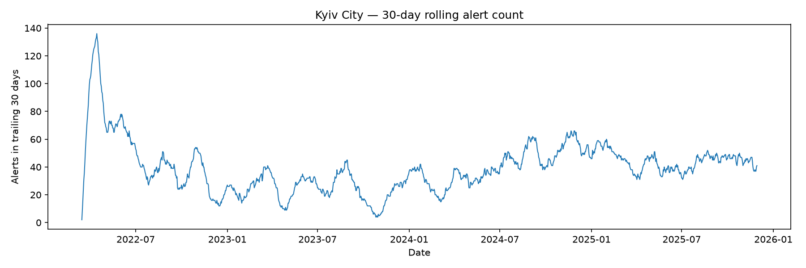
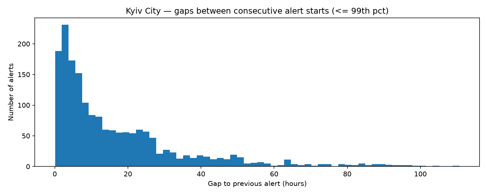
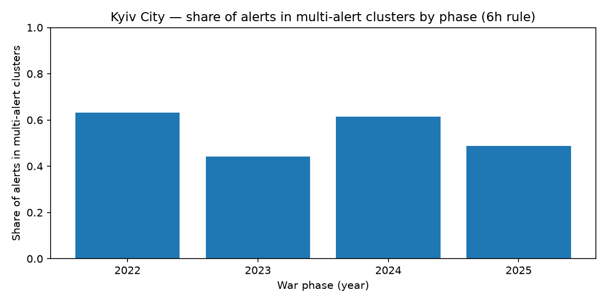
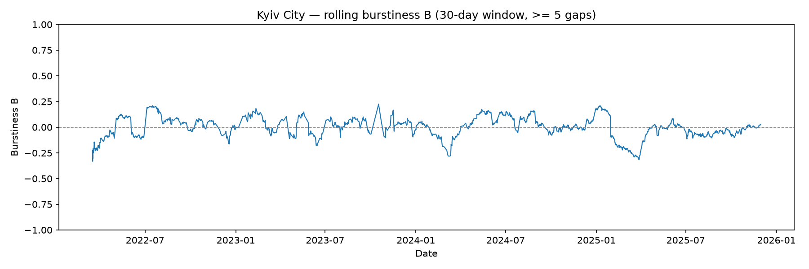

# Kyiv City Air Raid Alerts - Time-Series Analysis

A descriptive time-series analysis of how air raid alerts in Kyiv City cluster in time, and how the degree of that clustering varied across different periods of the war.

## Research question

How clustered in time are air raid alerts in Kyiv City, and how did the degree of clustering vary across different periods of the war?

The question is deliberately neutral. It does not assume clustering increased, decreased, or stayed flat - whatever the data shows is a valid answer.

## Why this matters

Air raid alerts shape daily life: when and how often they occur affects schooling, work, and shelter readiness. Knowing whether alerts tend to arrive as isolated events or in short-term series helps describe the rhythm of disruption that residents and planners face. This project measures that rhythm for Kyiv City. It is descriptive only: it does not predict attacks and makes no causal claims.

## Data source and scope

- Source: Vadimkin Ukrainian air raid sirens dataset, file `official_data_en.csv`.
- Unit of analysis: Kyiv City only (a distinct value from Kyivska oblast).
- One row = one recorded alert, with a start time and an end time. All timestamps are in UTC.
- Important: the dataset records alerts (siren activations), not confirmed attacks. An alert is a warning.
- Analysis window: 2022-03-15 to 2025-11-29. The window ends before the December 2025 change to raion (district) level recording, to keep the granularity consistent.

Cleaning trail (Kyiv City):

- Raw Kyiv City rows: 3,961.
- After date window 2022-03-15 to 2025-11-30: 3,590.
- After exact duplicate removal: 1,795 distinct alerts.
- Cleaned date range: 2022-03-15 to 2025-11-29.
- Exact duplicates removed: 1,795.
- No missing start or end values.
- No negative, zero, over-24-hour, or exactly-30-minute durations in the cleaned subset.

The cleaned dataset is saved as `data/processed/kyiv_city_alerts_clean.csv`.

## Methodology

The analysis uses simple, transparent steps. No prediction, no causal modelling.

1. Validate and clean - audit the raw file, isolate Kyiv City, restrict the date window, remove exact duplicate rows, and re-check.
2. Describe - daily and weekly alert counts, plus the gaps (in hours) between consecutive alert starts.
3. Define clusters - a "cluster" (series) is a run of alerts where each alert starts within N hours of the previous one. Main threshold 6 hours, with a sensitivity check at 3 hours and 12 hours.
4. Measure burstiness - the burstiness parameter B = (std_gap - mean_gap) / (std_gap + mean_gap), computed overall and in rolling 30-day windows (a 60-day window is used as a robustness check). B > 0 means more bursty, B near 0 means more random/even, B < 0 means more regular.

## Key results

1. Alerts often arrived in short-term series.
Under the 6-hour rule, 55.6% of Kyiv City alerts belonged to a multi-alert cluster. The median gap between alerts was 10.45 hours and the mean gap 18.13 hours (a right-skewed distribution: many shorter gaps, some long quiet periods), with an average of 9.27 alerts per week. The shortest gap was 0.10 hours and the longest 372.14 hours.

Cluster detail at the 6-hour threshold:

| Metric | Value |
|--------|-------|
| Total clusters | 1,170 |
| Single-alert clusters | 797 |
| Multi-alert clusters | 373 |
| Alerts in multi-alert clusters | 998 |
| Share of alerts in multi-alert clusters | 55.6% |
| Average cluster size | 1.534 |
| Maximum cluster size | 19 |
| Median multi-cluster span | 4.028 hours |

2. The clustering was moderate, not extreme.
The overall burstiness parameter was B = 0.1271 (on a -1 to +1 scale). Across 1,794 rolling 30-day windows (1,790 valid, 4 invalid), B ranged from -0.3322 to 0.2243, and rolling yearly averages stayed close to zero. The timing was somewhat uneven, not sharply bursty.

3. Clustering varied across years - it did not rise steadily.
Both methods show 2022 and 2024 as the more clustered years and 2023 and 2025 as less clustered.

| Year | Cluster share (6h) | Average rolling B (30d) |
|------|--------------------|--------------------------|
| 2022 | 63.2% | -0.0253 |
| 2023 | 44.2% | +0.0225 |
| 2024 | 61.4% | +0.0295 |
| 2025 | 48.9% | -0.0416 |

(2025 is a partial year, ending 2025-11-29.)

4. The result depends on how a "series" is defined.
Cluster share changes with the threshold, so the headline number is reported as a range:

| Threshold | Share of alerts in multi-alert clusters |
|-----------|------------------------------------------|
| 3 hours | 32.65% |
| 6 hours | 55.60% |
| 12 hours | 76.60% |

5. Two independent methods agree.
A threshold-based count (cluster share) and a threshold-free distribution measure (burstiness B) produced the same year-level pattern. Agreement between two unrelated methods gives the conclusion more weight than either alone.

Conclusion: Kyiv City air raid alerts often appeared in short-term series, but the degree of clustering was moderate and varied over time rather than increasing linearly. Clustering was higher in 2022 and 2024 and lower in 2023 and 2025.

## Figures

30-day rolling alert count - overall intensity over the war:



Gaps between consecutive alert starts - the raw basis for clustering:



Cluster share by phase (6h rule) - the headline year pattern:



Rolling burstiness B (30-day window) - the second, independent method:



Supporting tables are in `outputs/tables/`: `cluster_summary_thresholds.csv`, `top_10_clusters_6h.csv`, `rolling_burstiness_30d.csv`, and `rolling_burstiness_60d.csv`.

## Limitations

- The dataset records alerts (siren activations), not confirmed attacks.
- Covers Kyiv City only, not Kyivska oblast.
- Exact duplicate rows were removed, which roughly halved the windowed records to 1,795 distinct alerts; results depend on that cleaning decision.
- The window ends 2025-11-29 to avoid the December 2025 granularity change, so 2025 is a partial year resting on a smaller sample.
- The 6-hour cluster threshold is a modelling choice, not a natural fact; the headline share is therefore reported as a range.
- The burstiness parameter depends on the rolling window size; a 60-day window was checked as a robustness test.
- The analysis measures alert time / potential disruption time, not actual shelter time, because the dataset contains no civilian behavioral data.
- The analysis is purely descriptive: no causal claims and no predictions.

## Future work

A natural next step would be to compare alert burden (potential disruption time) with documented attack-event data, to describe how alert activity relates to recorded strike activity. This was deliberately left out of the main project to avoid scope creep, data-matching problems, and the risk of overclaiming. Two viable sources for such an extension are ACLED (geolocated, event-level conflict data) and the "Massive Missile Attacks on Ukraine" Kaggle dataset (daily munitions counts). The main obstacle is a resolution mismatch: alerts are timed intervals, while attack records are date-level events or daily counts. Any such comparison would have to stay descriptive (co-occurrence only, never causal or impact-verified) and would best be done at daily resolution.

## How to reproduce

```
pip install -r requirements.txt
python src/01_data_validation.py
python src/02_clean_kyiv_city.py
python src/03_basic_timeseries.py
python src/04_cluster_analysis.py
python src/05_rolling_burstiness.py
```

Outputs are written to `outputs/figures/` and `outputs/tables/`.

## Repository structure

```
.
|-- README.md
|-- requirements.txt
|-- data/
|   |-- official_data_en.csv
|   `-- processed/
|       `-- kyiv_city_alerts_clean.csv
|-- src/
|   |-- 01_data_validation.py
|   |-- 02_clean_kyiv_city.py
|   |-- 03_basic_timeseries.py
|   |-- 04_cluster_analysis.py
|   `-- 05_rolling_burstiness.py
|-- outputs/
|   |-- figures/
|   `-- tables/
`-- docs/
    |-- ai_interaction_log.md
    `-- reflection.md
```

## AI-assisted workflow note

This project was built with AI used as a thinking partner, not a code generator. The work moved from a vague assignment to a focused, neutral research question; the original framing assumed clustering had increased over time and was deliberately reworded to avoid building in a conclusion. Data was audited before analysis, which surfaced real issues (a city-versus-oblast split, large numbers of exact duplicates, and a December 2025 granularity change), each handled explicitly. Methods were kept deliberately simple, and change point detection was rejected to avoid causal over-interpretation. When two methods gave different-looking numbers, they were reconciled rather than cherry-picked. The full decision trail is documented in `docs/ai_interaction_log.md` and `docs/reflection.md`.
